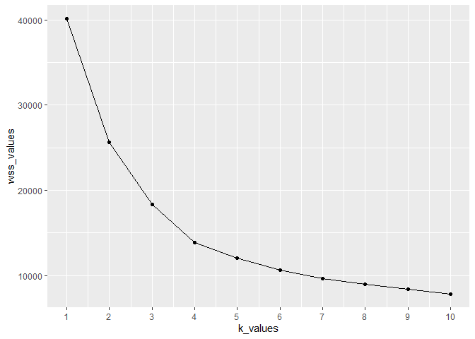
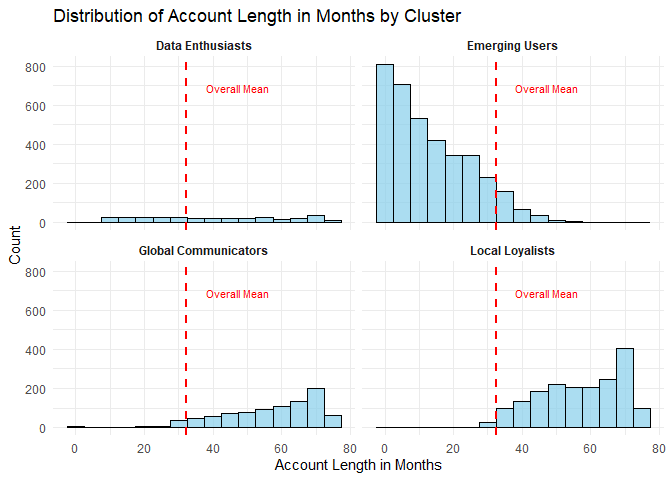
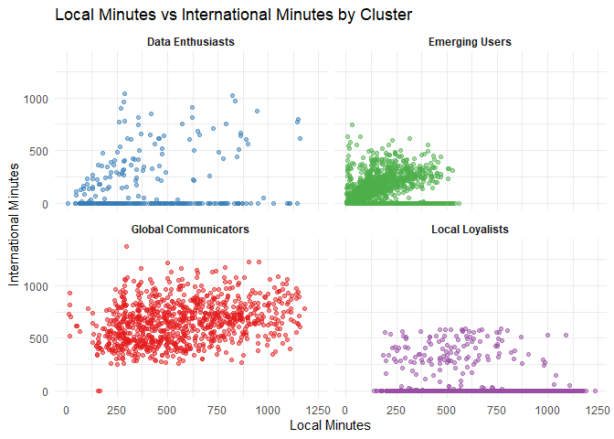

Cluster Analysis in R
================
Roberto Busby
February 07, 2024

- [SkyLink Communications Customer Cluster
  Analysis](#skylink-communications-customer-cluster-analysis)
  - [Data Preparation and
    Exploration](#data-preparation-and-exploration)
    - [Descriptive Statistics](#descriptive-statistics)
    - [Data Quality](#data-quality)
  - [Data Normalization](#data-normalization)
  - [Determining the Optimal Number of Clusters using the Elbow
    Method](#determining-the-optimal-number-of-clusters-using-the-elbow-method)
    - [Elbow Plot Setup](#elbow-plot-setup)
    - [Visualization](#visualization)
    - [Elbow Plot Interpretation](#elbow-plot-interpretation)
  - [K-Means Clustering](#k-means-clustering)
    - [Perform Clustering](#perform-clustering)
    - [Exploring the Clustering
      Object](#exploring-the-clustering-object)
  - [Cluster Analysis](#cluster-analysis)
    - [Observations](#observations)
    - [Joining with the Original
      Dataset](#joining-with-the-original-dataset)
  - [Cluster Characteristic Summary](#cluster-characteristic-summary)
    - [Cluster Visualizations](#cluster-visualizations)

# SkyLink Communications Customer Cluster Analysis

## Data Preparation and Exploration

``` r
#Import necessary libraries for data manipulation, visualization, and clustering analysis. 
library(tidyverse)
library(cluster)
library(fpc)
```

``` r
#Load the dataset
cust_df <-
  read.csv("Dataset2_SkyLink Communications - Customer.csv")
View(cust_df)
```

Isolate the continuous variables from the original dataset that are
relevant for the clustering process. Continuous variables are chosen
because they can be easily normalized and used in distance calculations,
which is an essential parts of k-means clustering algorithm.

Variables selected to understand customer behavior and preferences as
they directly relate to how customers interact with services and how
much value they derive from them:

- Customer Tenure (Account Length in Months)

  - Long-term customers may have different needs and values compared to
    newer customers, and their loyalty can be leveraged in marketing
    strategies.

- Service offerings (International or Domestic calls, Data needs)

  - Usage patterns can identify customers who have family, friends, or
    business interests abroad, indicating a specific need for
    international calling plans.

  - Identify customers who use their service primarily for local
    communication, possibly for personal or business use within the
    country.

  - With increasing reliance on smartphones and internet services, data
    usage is a critical variable. High data users might rely on their
    service for entertainment, work, or staying connected on social
    media.

- Charges (International and Data)

  - The amount customers are willing to pay or are charged for services
    can indicate their service tier, usage patterns, and sensitivity to
    price.

  - High charges might correlate with high usage or subscription to
    premium services, whereas lower charges might indicate minimal usage
    or subscription to basic plans.

``` r
#create a subset containing only continuous variables for clustering.
quant_vars <- select(
  cust_df,
  Account.Length..in.months.,
  Local.Mins,
  Intl.Mins,
  Extra.International.Charges,
  Extra.Data.Charges,
  Total.Charges
)
```

### Descriptive Statistics

These statistics give a quick overview of the distribution of each
variable, including central tendency (median and mean) and dispersion
(range from min to max and interquartile range). Done to assess the
overall structure and characteristics of the data, ensuring that the
data is suitable for clustering analysis by checking for anomalies or
patterns that need to be addressed in preprocessing.

- The presence of zeros in median values for international calls and
  minutes, along with extreme maximum values, suggests that the dataset
  includes a wide range of customer behaviors, from non-users to heavy
  users of international services.

- The significant difference between mean and median values for some
  variables indicates skewed distributions, likely with outliers.

``` r
#summary stats of all of the observations in the dataset
summary(quant_vars)
```

    ##  Account.Length..in.months.   Local.Mins       Intl.Mins     
    ##  Min.   : 1.00              Min.   :   4.0   Min.   :   0.0  
    ##  1st Qu.: 9.00              1st Qu.:  76.9   1st Qu.:   0.0  
    ##  Median :29.00              Median : 250.5   Median :   0.0  
    ##  Mean   :32.34              Mean   : 322.8   Mean   : 130.1  
    ##  3rd Qu.:55.00              3rd Qu.: 498.1   3rd Qu.: 140.4  
    ##  Max.   :77.00              Max.   :1234.2   Max.   :1372.5  
    ##  Extra.International.Charges Extra.Data.Charges Total.Charges 
    ##  Min.   :  0.00              Min.   : 0.000     Min.   :   6  
    ##  1st Qu.:  0.00              1st Qu.: 0.000     1st Qu.: 181  
    ##  Median :  0.00              Median : 0.000     Median : 647  
    ##  Mean   : 33.64              Mean   : 3.374     Mean   :1084  
    ##  3rd Qu.: 16.40              3rd Qu.: 0.000     3rd Qu.:1732  
    ##  Max.   :585.80              Max.   :99.000     Max.   :5574

### Data Quality

Assess the completeness of the dataset and identify columns with missing
values that might require attention before clustering.

The absence of missing values in these key variables enhances the
reliability of subsequent clustering analysis, as it ensures that all
observations can be utilized without the need for imputation or
exclusion strategies that could potentially bias the results.

``` r
#Check for na's in all of the columns
na_summary <- quant_vars %>%
  summarise_all(~ sum(is.na(.)))
na_summary
```

    ##   Account.Length..in.months. Local.Mins Intl.Mins Extra.International.Charges
    ## 1                          0          0         0                           0
    ##   Extra.Data.Charges Total.Charges
    ## 1                  0             0

## Data Normalization

Normalize the continuous variables so that each variable contributes
equally to the distance computations in the clustering algorithm,
preventing variables with larger scales from dominating the distance
metric simply due to their size.

``` r
#normalize each variable
quant_vars_n <- scale(quant_vars)
View(quant_vars_n)
```

## Determining the Optimal Number of Clusters using the Elbow Method

### Elbow Plot Setup

The WSS (within-cluster sum of squares) is a measure of the compactness
of the clusters and is used to assess the quality of the clustering. A
lower WSS value indicates that the data points are closer to the
centroids of their respective clusters.

``` r
#create a function wss to calculate the total within-cluster sum of squared deviations for different values of k (number of clusters)

wss <- function(k) {
  kmeans(quant_vars_n, k, nstart = 10)
}$tot.withinss

#range of k values for elbow plot
k_values <- 1:10

#Use the wss function with a range of k values (1 to 10) to compute the within-cluster sum of squares for each k.
wss_values <- map_dbl(k_values, wss)

#create a new data frame containing both k_values and wss_values
elbowdf <- data.frame(k_values, wss_values)
```

The idea is to choose a small value of k that still has a low WSS and is
explaining most of the variance. As one increases k, the WSS will
naturally decrease because there are more clusters; thus, each cluster
will be smaller. The goal is to find the value of k at which the rate of
decrease sharply changes, which typically signifies that adding more
clusters does not provide much better modeling of the data. This point
is known as the “elbow.”

### Visualization

``` r
#Plot the elbow plot to visually determine the optimal number of clusters based on the point where the decrease in the within-cluster sum of squares (WSS) begins to slow down (elbow point)
ggplot(elbowdf, mapping = aes(x = k_values, y = wss_values)) +
  geom_line() +
  geom_point() +
  scale_x_continuous(breaks = seq(1, 10, 1))
```

<!-- -->

### Elbow Plot Interpretation

Looking at the plot, the WSS decreases rapidly as the number of clusters
increases from 1 to 4 and then starts to level off, indicating that the
rate of decrease in WSS is slowing down. The “elbow” of the plot, or the
point after which the decrease in WSS becomes less pronounced, appears
to be around `k = 4`. This suggests that increasing the number of
clusters beyond 4 does not lead to substantially better fitting within
clusters, meaning that the additional clusters are not capturing as much
of the structure of the data as the first few clusters.

## K-Means Clustering

### Perform Clustering

Based on the elbow plot, 4 is selected as the optimal number of
clusters. This decision is critical because it determines the
granularity of the clustering. A lower number of clusters might merge
distinct groups, while a higher number might split cohesive groups into
smaller, less meaningful ones.

The restart value of `nstart = 1000` is done to mitigate the dependence
of the k-means algorithm on the initial position of centroids, which can
significantly affect the final clusters. Multiple restarts increase the
chance of finding a global optimum solution rather than a local optimum.

``` r
#Set a random seed for reproducibility.
set.seed(32)
```

``` r
#Perform k-means clustering on the normalized data with the chosen number of clusters (k=4) and a high number of random restarts (nstart=1000) to ensure a good solution.
k4 <- kmeans(quant_vars_n, 4, nstart = 1000)
```

### Exploring the Clustering Object

Explore the resulting clustering object to understand the cluster
characteristics and the distribution of data points across clusters.

The 6687 observations are distrusted across the four clusters as follows
(i.e., Cluster Size):

- 902

- 305

- 3662

- 1818

<div>

``` r
#display the structure of the 4-means clustering object
str(k4)
```

    ## List of 9
    ##  $ cluster     : int [1:6687] 3 3 3 3 1 3 4 3 4 4 ...
    ##  $ centers     : num [1:4, 1:6] 0.988 0.352 -0.773 1.009 0.839 ...
    ##   ..- attr(*, "dimnames")=List of 2
    ##   .. ..$ : chr [1:4] "1" "2" "3" "4"
    ##   .. ..$ : chr [1:6] "Account.Length..in.months." "Local.Mins" "Intl.Mins" "Extra.International.Charges" ...
    ##  $ totss       : num 40116
    ##  $ withinss    : num [1:4] 4833 1926 3275 3846
    ##  $ tot.withinss: num 13880
    ##  $ betweenss   : num 26236
    ##  $ size        : int [1:4] 902 305 3662 1818
    ##  $ iter        : int 3
    ##  $ ifault      : int 0
    ##  - attr(*, "class")= chr "kmeans"

</div>

The between-Cluster Sum of Squares (between_SS) as a Percentage of Total
Sum of Squares (total_SS) is 65.4%

- 65.4% of the total variance is attributed to the differences between
  clusters, which is relatively high and suggests that the clusters are
  well-differentiated from each other.

- The relatively high between_SS/total_SS ratio suggests that the
  clustering has meaningful business implications, as it reflects
  substantial differences in customer behaviors or characteristics
  across the clusters.

- The difference in WSS values across clusters highlights varying levels
  of cohesion within each cluster, with Cluster 2 being the most
  cohesive.

- Cluster 1 shows the highest WSS, suggesting it has the most
  considerable internal variance among its members, possibly indicating
  a more diverse set of observations within this cluster.

``` r
#display information on 4-means clustering
k4
```

    ## K-means clustering with 4 clusters of sizes 902, 305, 3662, 1818
    ## 
    ## Cluster means:
    ##   Account.Length..in.months. Local.Mins   Intl.Mins Extra.International.Charges
    ## 1                  0.9877385  0.8388882  2.13772196                  1.88206658
    ## 2                  0.3520496  0.2460764  0.07735022                  0.06522677
    ## 3                 -0.7734712 -0.6828867 -0.32308867                 -0.26466720
    ## 4                  1.0088758  0.9180422 -0.42280875                 -0.41160997
    ##   Extra.Data.Charges Total.Charges
    ## 1         -0.1355015     0.7930763
    ## 2          4.0869200     0.5067333
    ## 3         -0.2026825    -0.6501945
    ## 4         -0.2101568     0.8311903
    ## 
    ## Clustering vector:
    ##    [1] 3 3 3 3 1 3 4 3 4 4 4 3 3 4 3 4 4 3 3 3 3 4 4 3 1 3 4 3 4 3 4 4 4 3 4 4 4
    ##   [38] 3 4 4 4 4 3 3 4 2 4 3 3 4 4 4 4 4 3 3 2 3 3 4 4 3 3 3 4 4 4 4 4 3 4 4 3 4
    ##   [75] 3 4 4 4 4 4 3 3 4 3 4 4 3 4 3 4 4 3 4 4 4 4 4 1 4 3 3 4 4 2 3 3 3 3 4 3 4
    ##  [112] 4 4 3 3 3 4 3 3 3 3 3 4 4 4 4 4 3 4 3 3 4 3 4 4 3 3 3 4 4 4 4 3 4 3 3 3 3
    ##  [149] 4 2 4 4 4 3 3 3 3 4 1 3 4 3 3 2 4 4 3 3 4 4 3 4 3 4 4 4 3 1 4 3 3 3 3 3 3
    ##  [186] 4 3 3 4 2 3 3 3 4 2 3 4 3 4 3 3 4 3 4 4 2 4 3 3 4 4 3 3 3 4 4 4 3 4 4 3 3
    ##  [223] 4 3 4 3 3 3 3 4 2 4 4 3 3 2 3 4 3 3 4 4 4 3 1 3 4 4 4 2 4 3 3 3 3 2 4 4 3
    ##  [260] 3 3 3 4 3 1 4 3 3 4 4 4 3 2 4 3 1 4 3 2 4 3 4 3 3 4 3 3 4 4 4 4 4 1 3 1 1
    ##  [297] 3 3 3 3 3 3 2 1 1 1 1 3 3 2 3 1 3 1 3 3 1 3 3 1 1 1 1 1 3 3 1 1 3 2 3 3 3
    ##  [334] 1 1 3 3 1 1 1 1 2 3 1 1 3 1 3 1 3 3 1 3 3 4 4 3 1 3 3 1 3 4 3 3 2 3 1 1 1
    ##  [371] 1 1 2 3 3 3 1 1 3 3 1 3 1 1 4 4 1 3 3 1 1 3 1 3 2 3 1 1 1 1 3 1 1 1 1 1 2
    ##  [408] 3 3 1 1 3 3 3 1 3 1 1 1 3 1 1 3 4 1 3 1 3 3 1 1 1 3 3 4 3 3 1 1 1 3 1 3 3
    ##  [445] 2 3 3 3 4 1 4 4 3 3 1 3 1 3 3 1 3 1 3 3 4 1 1 1 3 1 3 1 1 3 3 4 3 1 3 3 1
    ##  [482] 3 1 3 1 1 3 3 3 1 3 3 1 1 4 1 1 3 2 1 4 1 3 3 3 3 3 1 3 1 1 3 1 1 3 3 3 1
    ##  [519] 1 1 1 3 1 1 1 1 1 1 3 3 1 3 1 1 4 3 3 1 1 1 1 3 1 3 1 3 4 2 3 3 1 1 3 3 3
    ##  [556] 3 1 3 2 1 1 3 1 1 3 2 1 3 3 2 1 3 3 1 3 3 1 3 3 1 1 3 3 3 1 3 3 3 1 3 3 3
    ##  [593] 3 3 3 3 3 3 1 1 1 1 1 3 3 3 2 3 3 3 4 1 3 1 3 3 3 4 3 3 4 3 3 4 4 3 3 3 3
    ##  [630] 4 3 4 4 4 4 4 3 4 3 3 4 3 3 4 3 3 4 4 3 2 4 3 3 3 3 4 4 3 4 4 2 3 4 4 4 4
    ##  [667] 3 3 4 3 4 4 4 3 4 2 3 3 3 1 4 3 4 3 3 3 3 4 4 3 3 3 4 3 3 4 3 3 4 2 3 4 1
    ##  [704] 3 4 4 3 3 3 3 4 3 3 4 4 4 4 4 4 4 4 3 4 3 4 2 3 4 3 4 3 3 2 4 3 1 3 4 3 3
    ##  [741] 4 4 3 4 4 3 4 3 3 3 3 3 4 3 4 4 4 4 3 3 3 3 4 4 4 4 4 4 3 4 3 3 4 3 4 4 4
    ##  [778] 4 4 3 3 3 4 4 3 3 2 4 4 3 3 3 4 3 4 4 3 4 2 3 4 4 3 3 3 3 4 3 4 3 4 4 4 4
    ##  [815] 3 3 4 3 2 4 4 4 3 3 3 4 4 4 3 4 4 4 4 2 3 3 3 3 3 3 3 3 4 3 4 4 4 3 1 3 3
    ##  [852] 4 2 3 4 3 3 1 3 3 3 4 3 3 3 3 3 4 3 4 4 4 3 3 3 3 4 3 3 4 3 3 3 4 3 4 1 4
    ##  [889] 3 3 4 3 3 3 4 4 3 4 4 2 4 4 4 4 3 4 3 3 4 3 4 3 3 4 3 3 4 1 4 3 3 4 4 3 3
    ##  [926] 3 3 3 3 4 3 4 4 3 3 3 4 2 3 4 4 4 1 3 3 3 4 3 4 4 4 3 4 1 4 3 4 4 3 4 4 4
    ##  [963] 2 3 3 4 4 3 4 3 4 4 3 1 3 2 4 3 3 1 3 4 3 4 4 4 3 3 3 4 3 4 3 4 4 4 4 3 3
    ## [1000] 3 3 4 4 4 4 4 3 4 4 3 3 3 1 3 4 4 3 4 3 3 3 4 3 3 2 3 4 4 3 3 4 3 4 4 2 4
    ## [1037] 4 4 3 4 1 2 4 4 3 4 4 3 4 4 3 4 1 2 4 4 3 3 4 3 4 4 4 4 2 4 3 3 3 3 3 3 4
    ## [1074] 4 3 3 3 4 3 4 4 3 3 2 3 3 3 3 3 4 3 4 4 4 2 3 3 4 4 4 3 3 4 3 3 4 3 4 2 1
    ## [1111] 3 3 3 4 3 3 3 4 4 2 3 3 4 3 3 2 3 4 3 3 2 3 3 4 3 3 4 4 3 4 3 3 1 4 3 2 3
    ## [1148] 4 3 2 3 4 4 2 3 3 3 4 2 4 4 3 4 3 2 1 3 3 2 4 3 3 4 3 3 4 4 3 4 4 3 3 4 3
    ## [1185] 3 3 3 3 4 3 3 3 3 4 3 4 4 4 4 4 4 4 4 4 3 4 4 4 3 3 4 3 3 4 2 4 4 3 3 3 4
    ## [1222] 4 3 1 4 4 3 3 3 4 1 4 4 3 3 3 4 3 4 3 3 4 4 3 3 3 3 3 1 3 4 3 4 3 3 2 1 3
    ## [1259] 4 4 3 4 4 3 3 3 3 3 4 4 3 4 4 3 4 3 4 4 4 3 4 3 3 3 4 3 4 4 3 4 4 4 4 3 4
    ## [1296] 4 3 3 4 4 3 4 3 4 3 3 3 4 4 3 4 4 3 3 3 3 4 2 4 3 4 4 3 4 4 4 4 3 4 3 4 3
    ## [1333] 4 3 3 3 4 1 3 4 3 4 1 3 3 4 1 3 1 3 3 1 1 1 3 4 1 3 1 3 3 1 3 3 3 3 3 4 3
    ## [1370] 3 4 1 1 1 3 3 3 1 1 1 3 3 1 3 3 1 4 3 3 3 3 3 1 1 2 3 1 1 3 2 3 3 3 1 3 3
    ## [1407] 3 3 1 1 1 3 3 3 3 3 3 3 1 1 1 3 1 2 3 1 1 1 1 1 3 3 1 3 3 1 3 3 3 3 3 1 1
    ## [1444] 1 1 1 3 3 1 3 3 3 1 4 1 1 1 1 3 3 2 3 3 3 1 3 3 3 1 3 3 1 1 1 1 1 3 1 1 3
    ## [1481] 3 3 3 1 1 1 3 1 3 1 1 3 1 1 3 1 1 1 3 3 1 1 1 1 1 3 3 3 1 3 1 1 3 3 4 3 1
    ## [1518] 1 1 3 1 2 3 3 3 1 2 1 1 3 1 3 3 1 1 1 1 3 1 3 3 1 1 3 3 3 1 3 3 1 3 3 3 2
    ## [1555] 1 3 3 1 1 1 1 1 1 4 3 3 3 3 3 3 3 3 2 1 3 3 3 3 3 3 1 3 3 4 3 3 2 1 1 1 1
    ## [1592] 3 1 1 1 3 1 1 1 3 3 3 3 1 1 1 1 1 1 3 3 3 3 3 3 2 4 1 3 3 4 4 3 3 3 3 3 4
    ## [1629] 4 3 3 3 3 3 4 4 3 3 3 3 3 4 3 3 2 4 4 4 4 3 4 4 4 4 3 4 4 4 4 4 3 3 3 3 4
    ## [1666] 3 2 4 3 3 3 3 3 4 3 3 3 3 4 4 4 3 4 4 4 3 4 3 3 3 3 3 3 3 3 3 1 1 3 3 3 3
    ## [1703] 4 3 4 3 4 4 4 4 3 4 2 3 4 3 3 3 4 3 3 4 4 2 3 4 3 3 2 3 3 3 4 3 4 4 3 3 4
    ## [1740] 4 1 3 4 3 3 4 3 4 3 3 4 3 4 3 2 3 3 3 4 3 3 3 3 3 3 3 3 3 3 3 3 4 4 3 3 3
    ## [1777] 4 4 3 3 4 4 4 3 4 3 3 4 4 4 3 4 3 3 4 3 3 4 4 3 4 4 3 3 3 3 3 3 3 4 3 3 2
    ## [1814] 3 4 3 2 3 3 3 1 3 4 3 4 2 4 4 4 3 3 3 3 4 3 4 1 4 3 3 4 3 3 4 4 2 4 3 4 3
    ## [1851] 4 3 3 3 3 4 3 3 4 3 2 3 4 4 3 3 4 2 3 4 4 4 3 2 4 4 3 4 4 3 4 3 4 3 4 3 4
    ## [1888] 4 4 3 4 3 3 4 4 3 4 3 4 4 3 4 4 3 3 3 4 4 4 4 2 4 4 4 4 3 2 4 3 4 2 3 3 3
    ## [1925] 3 4 4 3 3 4 3 3 3 4 4 3 3 4 3 3 3 3 2 4 4 3 3 3 4 3 3 4 3 3 3 4 3 4 3 3 3
    ## [1962] 3 3 4 4 2 4 4 4 4 4 3 3 3 3 2 3 3 3 3 3 4 4 3 3 4 3 4 3 3 3 3 2 4 3 1 4 3
    ## [1999] 4 2 4 4 3 4 3 3 3 3 4 4 4 4 4 4 3 4 3 4 4 4 3 3 4 3 4 3 4 3 3 4 3 4 3 3 3
    ## [2036] 4 4 4 4 4 3 4 3 3 3 3 4 3 3 4 3 4 4 4 3 4 3 3 3 3 4 3 4 3 4 4 3 3 4 3 3 4
    ## [2073] 3 3 3 4 4 4 4 3 3 4 4 3 3 3 3 3 4 1 3 3 3 4 3 3 4 4 4 1 4 4 3 3 1 4 3 1 3
    ## [2110] 4 3 3 3 4 3 4 4 4 3 4 4 3 2 4 4 3 3 4 3 3 3 3 2 3 4 3 3 4 4 4 4 3 2 3 4 3
    ## [2147] 4 3 4 4 3 4 4 2 3 3 3 4 3 3 3 3 3 3 4 1 3 3 4 4 3 3 4 2 3 4 3 4 4 3 3 3 4
    ## [2184] 4 3 4 3 4 4 3 4 4 4 3 3 4 3 3 3 4 3 3 3 4 4 4 4 3 4 3 4 2 3 4 4 4 4 2 3 4
    ## [2221] 3 3 4 1 1 3 3 4 4 3 3 4 3 3 3 3 3 3 3 3 4 3 3 4 4 3 1 3 4 4 4 3 3 3 4 3 4
    ## [2258] 4 4 3 3 4 3 3 4 3 3 4 4 3 4 3 2 1 3 3 1 3 3 4 4 1 3 2 3 4 3 4 3 3 4 4 4 3
    ## [2295] 3 3 4 4 4 3 3 4 3 4 3 4 3 2 4 4 3 4 3 3 4 4 3 4 4 4 4 4 4 2 4 3 3 4 4 3 3
    ## [2332] 3 4 3 4 4 3 3 3 4 4 4 3 2 3 4 3 4 2 4 1 3 3 3 3 3 3 4 3 3 2 4 4 3 4 4 2 4
    ## [2369] 4 3 3 4 3 3 3 3 4 2 3 4 4 4 3 2 1 4 3 4 4 3 4 3 3 3 3 3 1 4 3 4 4 3 4 4 4
    ## [2406] 3 3 3 4 3 4 3 2 3 3 3 4 4 4 3 4 4 2 4 4 3 4 3 3 3 4 4 3 3 2 3 3 4 4 4 3 4
    ## [2443] 4 4 3 3 4 3 3 4 4 3 4 4 3 3 4 4 3 3 4 3 4 3 4 4 3 3 3 4 3 3 4 3 4 3 4 2 3
    ## [2480] 3 3 3 4 2 3 4 3 4 4 1 4 4 3 2 4 3 3 3 3 4 4 3 4 2 4 4 4 3 3 3 4 3 2 4 3 4
    ## [2517] 4 3 3 3 3 4 3 3 3 3 3 3 4 3 3 3 3 3 3 4 1 3 2 4 4 4 3 3 3 4 4 4 3 2 4 3 3
    ## [2554] 4 3 4 2 4 3 4 4 4 4 4 4 3 2 4 3 3 4 4 4 3 4 3 3 3 4 2 3 4 3 2 4 2 3 3 3 4
    ## [2591] 3 3 4 3 4 3 3 4 3 4 4 3 4 4 1 2 3 3 4 4 4 4 3 3 3 4 2 3 4 4 3 4 4 3 3 2 4
    ## [2628] 4 4 4 3 4 4 1 3 4 3 1 3 3 3 4 4 3 4 2 3 4 3 3 4 4 3 3 4 1 4 4 3 3 4 4 4 1
    ## [2665] 3 4 3 2 1 4 4 4 3 3 1 3 3 3 3 3 4 3 4 3 3 3 4 3 2 3 1 3 4 3 4 4 4 3 4 3 3
    ## [2702] 4 4 4 3 3 4 3 4 3 3 4 4 3 2 3 3 3 3 3 4 3 3 4 4 4 3 3 4 3 3 4 4 3 3 3 2 3
    ## [2739] 3 1 1 1 2 3 1 3 1 1 2 3 1 1 2 1 3 3 1 2 3 3 3 4 1 3 3 1 3 3 1 1 3 3 1 3 3
    ## [2776] 1 3 3 3 1 1 3 3 1 3 1 2 3 1 1 3 3 1 1 1 1 1 3 3 4 1 1 3 3 3 3 3 1 1 3 3 1
    ## [2813] 3 1 3 3 1 1 3 1 3 3 2 1 1 3 1 1 2 1 1 1 3 2 1 1 3 1 2 1 1 1 1 1 3 1 1 1 1
    ## [2850] 1 1 1 1 3 3 2 1 1 3 3 1 1 1 1 1 3 3 1 1 1 3 3 1 1 3 3 1 3 3 3 2 3 1 3 1 1
    ## [2887] 3 4 1 1 1 3 3 3 1 1 1 1 2 1 1 3 1 3 1 3 1 1 3 1 1 1 3 3 1 3 1 3 3 1 3 3 3
    ## [2924] 2 1 3 3 3 3 1 1 3 1 4 3 3 1 1 3 1 1 3 4 3 3 1 4 3 3 3 1 3 3 1 3 3 1 3 1 3
    ## [2961] 3 1 1 1 1 1 3 1 1 1 3 4 3 3 3 1 3 3 1 1 3 3 3 1 1 1 2 3 3 1 3 3 3 1 1 3 3
    ## [2998] 1 1 3 3 3 1 3 1 3 3 4 1 1 1 3 3 1 1 3 1 3 1 3 1 3 2 3 3 1 3 3 3 3 1 3 1 4
    ## [3035] 1 3 1 1 3 3 3 1 1 1 2 3 3 1 1 3 3 4 3 3 3 1 3 1 3 1 1 1 3 3 3 2 1 3 3 3 1
    ## [3072] 3 3 1 3 1 1 3 3 3 1 3 1 1 3 1 3 3 1 1 1 1 3 3 1 3 3 3 2 1 3 3 1 1 2 1 3 4
    ## [3109] 3 4 4 3 3 3 3 3 3 3 3 4 3 3 3 3 4 4 3 4 4 3 2 4 3 3 4 3 3 3 4 4 3 4 3 3 3
    ## [3146] 3 3 1 4 4 3 3 4 4 4 4 3 3 3 4 3 3 2 3 4 3 4 2 3 3 3 3 4 2 3 4 3 4 4 3 4 1
    ## [3183] 4 2 3 3 3 4 3 4 3 3 3 4 4 3 4 3 3 4 3 3 4 3 3 3 3 4 1 3 3 4 4 2 3 4 4 2 1
    ## [3220] 4 3 3 4 4 3 3 3 3 3 3 4 3 3 4 4 4 3 3 3 4 1 3 4 4 4 3 3 1 3 3 4 4 3 4 3 3
    ## [3257] 4 3 4 3 4 3 3 4 4 1 3 4 3 4 3 4 3 3 4 4 3 3 3 3 4 4 4 3 4 3 4 4 1 4 4 4 4
    ## [3294] 3 4 4 4 4 3 2 4 3 4 3 3 3 3 4 1 4 3 3 3 3 4 3 4 4 4 4 3 3 1 4 4 3 4 4 4 3
    ## [3331] 2 4 3 3 3 3 4 3 3 2 3 4 3 4 4 3 3 3 3 4 4 4 3 4 4 3 3 3 3 4 4 4 4 4 4 3 3
    ## [3368] 4 3 4 4 4 1 3 2 4 4 4 3 3 4 4 3 3 4 3 3 4 4 4 4 4 2 3 3 3 3 3 4 4 3 4 4 3
    ## [3405] 3 3 4 3 3 4 3 2 1 3 4 3 3 3 4 3 2 3 3 1 4 3 4 4 3 3 4 3 3 4 4 3 3 3 2 1 4
    ## [3442] 4 3 4 4 3 3 4 4 4 4 3 3 3 4 3 3 4 3 4 3 3 3 4 4 3 3 4 3 3 3 3 3 4 3 4 3 3
    ## [3479] 4 3 2 4 4 3 3 3 2 3 4 4 4 4 4 3 3 3 3 1 3 3 4 1 3 3 3 3 4 4 3 3 3 3 3 3 3
    ## [3516] 3 3 3 3 3 3 4 3 3 3 3 4 3 1 3 3 3 3 3 4 3 4 3 4 3 3 3 2 4 4 3 3 3 3 2 3 3
    ## [3553] 3 3 3 3 2 4 4 3 3 3 3 3 4 3 1 3 3 3 3 3 3 3 3 3 3 2 3 3 3 3 3 3 2 3 3 3 4
    ## [3590] 3 3 3 3 3 3 4 4 4 2 3 3 3 3 3 4 3 3 3 1 4 4 4 2 4 3 3 3 3 3 3 3 3 3 3 3 3
    ## [3627] 4 3 3 3 3 3 3 3 3 3 1 4 4 3 2 3 3 3 3 3 3 2 3 3 3 4 4 2 3 4 3 4 4 3 2 3 3
    ## [3664] 4 4 3 3 2 3 3 4 3 3 3 3 3 4 4 3 3 3 4 4 3 3 3 3 3 3 3 3 3 3 3 3 2 3 3 3 3
    ## [3701] 3 3 3 3 4 3 4 3 3 2 3 3 3 3 3 3 2 3 3 3 3 3 3 4 3 3 3 3 3 4 3 3 3 3 3 4 3
    ## [3738] 3 3 4 3 3 3 3 2 3 3 4 3 4 3 3 3 3 3 3 3 2 3 4 3 3 3 3 3 3 4 3 3 3 3 3 3 3
    ## [3775] 3 3 3 3 3 3 3 3 3 3 3 3 3 1 4 1 3 3 3 3 3 4 1 3 3 1 4 3 3 3 1 3 3 3 4 3 3
    ## [3812] 3 1 3 3 3 3 1 3 3 3 3 3 4 1 4 3 2 3 3 3 3 3 3 2 3 3 3 3 3 3 3 4 3 3 4 1 2
    ## [3849] 3 1 3 3 3 3 3 3 1 3 3 3 3 1 3 1 1 3 3 3 3 4 3 3 3 4 3 3 3 3 3 4 3 3 2 3 3
    ## [3886] 4 3 3 4 3 3 3 3 4 3 4 2 3 4 3 3 3 3 2 3 3 3 3 3 3 3 3 3 3 3 3 4 2 3 3 3 3
    ## [3923] 4 3 2 3 3 3 3 3 4 2 4 3 3 3 4 3 3 3 3 3 4 3 2 3 3 3 3 4 3 3 3 3 3 4 4 3 2
    ## [3960] 4 3 3 3 3 4 3 3 3 4 3 3 3 2 3 3 3 4 3 3 3 3 3 1 3 4 3 3 3 3 4 3 3 4 3 1 3
    ## [3997] 3 3 3 3 2 3 3 3 3 4 4 3 3 3 3 3 3 3 3 4 3 3 3 3 4 3 4 3 4 3 3 3 3 3 3 3 3
    ## [4034] 3 3 3 4 4 3 3 3 1 3 3 1 3 3 3 3 3 3 3 3 3 2 3 4 3 4 4 3 3 3 3 4 4 3 3 2 3
    ## [4071] 4 3 3 3 2 4 1 3 3 3 3 2 4 1 3 1 3 3 3 1 3 3 3 3 3 3 3 3 4 4 4 3 3 3 4 3 3
    ## [4108] 3 3 3 4 3 3 3 1 3 3 1 3 3 1 3 3 2 3 1 3 3 1 3 3 4 3 2 3 3 3 1 3 4 4 3 3 3
    ## [4145] 3 3 2 3 3 3 3 3 3 3 3 3 3 3 3 3 3 3 3 3 3 3 3 3 3 3 3 3 3 2 3 3 3 3 1 3 3
    ## [4182] 3 1 3 1 3 3 3 3 3 3 3 3 3 3 3 3 3 1 1 3 3 1 3 3 1 3 3 3 3 3 3 3 3 3 4 4 3
    ## [4219] 3 3 3 1 3 1 3 3 1 3 3 3 3 3 3 3 3 3 3 4 3 1 1 3 3 1 3 3 1 3 3 3 3 3 3 3 3
    ## [4256] 3 3 3 3 3 3 1 3 3 3 3 1 2 3 3 3 3 3 3 3 3 3 3 1 3 3 3 1 3 4 3 3 2 1 3 3 3
    ## [4293] 3 1 1 3 1 3 3 1 3 2 3 3 3 3 3 3 3 3 3 3 1 1 3 2 3 3 3 3 3 3 3 3 3 3 3 3 3
    ## [4330] 3 3 3 3 3 3 1 1 3 3 1 3 3 1 3 3 3 3 1 3 3 3 3 1 3 3 4 3 2 3 3 3 3 1 3 2 4
    ## [4367] 3 3 3 3 3 2 1 3 3 3 3 3 3 3 1 3 1 3 2 3 3 3 3 3 2 3 3 1 3 1 1 3 3 3 1 3 3
    ## [4404] 3 3 3 1 3 3 1 3 3 3 3 3 4 3 3 3 3 3 3 3 3 3 3 3 3 4 2 4 3 1 3 3 3 2 3 1 3
    ## [4441] 1 3 3 2 3 3 1 3 1 3 1 3 1 3 1 3 4 3 3 3 3 1 3 3 1 3 3 3 3 3 1 3 3 3 3 3 3
    ## [4478] 1 3 3 3 3 1 3 3 2 3 3 3 1 3 3 3 3 3 3 3 3 2 3 1 3 3 3 1 3 3 4 1 3 3 3 3 3
    ## [4515] 3 3 2 3 3 3 1 3 1 1 3 3 3 3 3 4 3 3 3 1 3 3 3 3 3 3 3 3 3 3 3 3 1 3 3 1 2
    ## [4552] 3 1 1 3 1 3 1 3 1 3 3 3 3 3 3 3 3 3 3 3 3 3 3 1 3 1 3 1 3 1 3 3 3 1 3 3 3
    ## [4589] 3 2 3 3 3 1 3 2 3 3 3 3 1 3 3 3 1 3 3 4 3 3 1 3 3 3 1 3 3 1 3 3 1 3 3 3 3
    ## [4626] 3 1 3 3 3 3 3 3 1 1 3 3 3 3 3 4 3 2 3 3 3 3 1 2 3 3 3 3 1 3 2 1 3 3 4 3 3
    ## [4663] 3 1 3 3 3 3 3 3 3 3 3 3 1 3 3 3 1 1 3 3 3 3 1 1 1 3 3 3 3 3 3 3 3 3 1 3 1
    ## [4700] 3 4 3 3 3 3 3 1 3 3 3 3 1 3 3 3 3 3 3 3 3 3 3 4 3 3 3 3 3 3 4 3 1 1 3 3 3
    ## [4737] 3 1 1 1 3 3 3 3 3 3 3 3 4 1 4 3 3 3 4 4 4 3 3 1 3 4 4 1 3 3 3 3 4 3 4 3 3
    ## [4774] 3 3 3 3 4 3 4 3 3 2 3 4 3 3 3 4 2 3 3 3 3 3 3 2 4 4 3 3 3 3 3 3 3 4 3 3 2
    ## [4811] 3 3 3 3 3 2 3 4 3 4 3 3 2 3 3 3 4 3 3 3 3 4 4 3 3 3 3 3 3 4 3 3 2 3 3 3 3
    ## [4848] 4 3 3 3 3 3 3 3 3 4 4 3 3 3 4 3 3 3 4 3 2 3 3 3 4 4 3 3 3 3 3 3 3 3 4 4 3
    ## [4885] 3 3 3 4 3 3 3 3 3 2 4 3 3 3 3 3 3 4 3 3 3 3 3 4 3 3 3 3 3 4 4 3 3 2 3 4 3
    ## [4922] 3 3 3 3 4 3 3 3 3 3 2 3 4 4 3 3 4 2 3 3 3 3 3 3 3 3 3 3 4 3 3 3 3 3 3 3 3
    ## [4959] 3 3 4 3 2 4 3 4 4 3 3 4 3 3 3 3 3 3 3 3 4 3 3 3 2 3 3 3 3 3 3 2 4 4 3 4 3
    ## [4996] 4 3 3 4 4 3 4 4 3 3 3 3 3 3 3 3 3 4 3 3 3 3 3 4 3 3 3 4 3 4 4 3 3 3 3 3 3
    ## [5033] 3 3 3 3 4 3 3 4 3 3 3 4 2 4 4 3 3 3 3 3 3 3 3 3 3 3 3 3 3 3 3 3 3 4 4 3 3
    ## [5070] 3 3 4 3 3 3 3 3 2 3 4 4 4 3 3 3 4 3 3 3 3 3 3 4 4 4 2 4 4 3 3 3 3 1 4 4 3
    ## [5107] 3 3 3 3 1 3 3 3 4 3 3 3 4 4 3 3 3 3 3 4 3 4 4 3 3 4 3 3 3 3 3 3 3 3 3 3 4
    ## [5144] 3 3 4 4 3 3 3 4 3 3 3 3 3 1 3 3 3 3 3 3 3 1 3 3 2 4 3 3 3 2 3 3 3 3 3 3 3
    ## [5181] 3 3 3 3 3 3 1 3 4 2 4 4 3 4 4 4 3 3 3 3 4 3 4 3 3 3 3 3 3 3 3 3 3 1 3 3 1
    ## [5218] 1 4 3 1 1 1 1 1 3 1 1 1 1 1 2 1 3 3 1 2 1 1 3 4 1 1 3 1 1 3 3 1 1 2 3 3 3
    ## [5255] 3 3 3 3 3 3 3 3 1 3 3 1 1 1 1 1 3 1 1 1 4 1 3 1 1 3 1 3 3 1 3 1 3 1 2 3 1
    ## [5292] 1 3 3 3 3 4 4 2 4 3 4 2 4 3 3 4 4 3 3 3 4 4 3 3 3 1 4 3 3 3 3 4 3 3 3 3 4
    ## [5329] 4 4 4 4 4 3 4 3 4 4 4 4 3 4 4 4 4 4 4 3 4 3 3 3 4 4 4 3 4 3 4 4 4 4 4 4 4
    ## [5366] 4 4 3 3 3 3 2 4 4 4 3 4 3 4 3 4 3 4 3 4 3 4 3 3 3 3 4 3 4 3 4 3 4 4 4 4 3
    ## [5403] 4 4 4 3 3 3 3 2 3 4 4 4 4 3 4 4 4 4 1 4 1 3 4 4 4 3 3 4 3 4 4 4 3 4 4 4 4
    ## [5440] 4 4 4 3 3 3 3 3 3 4 3 3 3 3 3 3 4 4 4 3 4 3 3 3 4 3 4 4 4 3 3 4 4 3 3 3 3
    ## [5477] 4 4 4 4 4 3 3 4 3 3 3 3 2 3 4 4 3 3 3 3 3 1 4 4 4 4 3 4 1 3 4 3 3 4 3 3 3
    ## [5514] 3 1 4 1 1 1 1 1 1 3 1 3 3 1 1 1 3 1 1 1 3 1 1 4 1 1 1 1 3 3 3 1 3 3 3 3 2
    ## [5551] 1 3 1 3 3 3 3 3 1 3 3 1 1 1 3 1 4 3 1 3 3 1 1 1 2 1 1 3 4 4 1 3 1 1 1 1 1
    ## [5588] 1 3 1 4 1 2 3 1 3 4 1 3 3 1 3 1 1 3 1 1 3 3 2 3 3 3 1 3 3 1 1 1 4 1 3 4 1
    ## [5625] 4 2 3 1 3 3 4 3 1 3 1 1 1 1 3 1 1 3 1 1 1 3 1 3 3 1 1 2 1 1 3 1 3 1 3 1 2
    ## [5662] 2 4 4 4 4 4 3 3 3 4 4 4 4 4 3 3 4 3 4 4 4 3 3 3 4 4 2 3 4 4 4 3 3 3 3 1 3
    ## [5699] 1 2 3 3 1 3 1 3 2 4 4 4 3 4 4 4 4 4 4 3 3 2 4 4 4 3 3 4 4 3 3 3 4 3 4 4 3
    ## [5736] 3 3 4 3 4 4 1 4 3 3 4 4 3 3 1 3 3 3 3 4 1 4 2 4 3 4 3 3 3 4 3 4 3 4 3 4 3
    ## [5773] 3 4 3 3 3 4 4 3 4 4 3 4 2 4 2 3 4 3 3 3 3 4 3 4 4 4 3 4 3 3 4 4 3 3 4 3 4
    ## [5810] 4 4 3 2 4 3 4 3 4 4 3 4 3 3 3 4 3 3 4 4 4 4 3 4 4 3 4 4 4 2 3 3 3 3 4 4 4
    ## [5847] 3 3 3 3 3 3 3 3 4 1 4 3 1 4 3 3 4 3 3 3 1 3 3 4 4 4 3 3 4 3 3 4 4 3 3 3 3
    ## [5884] 3 3 4 4 3 3 1 3 3 3 4 2 3 4 4 4 4 3 4 3 4 4 3 3 3 4 3 4 4 3 4 2 4 4 4 3 2
    ## [5921] 4 4 4 4 4 3 3 4 3 4 4 3 4 3 4 4 1 4 4 3 4 3 3 3 4 3 4 4 3 1 3 3 4 3 4 3 4
    ## [5958] 3 3 4 2 1 3 3 4 3 4 3 4 4 3 4 4 3 3 4 2 4 4 4 4 2 3 3 4 4 4 3 3 3 3 4 3 3
    ## [5995] 4 4 4 4 4 3 3 3 4 3 4 4 3 3 3 3 3 4 3 3 3 3 4 3 4 3 3 4 3 3 3 3 4 3 3 4 3
    ## [6032] 3 4 3 3 4 4 3 4 3 4 3 3 4 3 2 3 4 4 3 3 3 4 4 3 4 1 3 3 4 4 4 3 3 3 4 3 4
    ## [6069] 4 4 3 3 3 3 4 4 3 4 3 4 3 3 3 3 4 3 4 4 3 4 4 4 4 1 3 4 4 4 1 4 3 1 3 3 4
    ## [6106] 3 4 4 4 3 4 1 4 4 1 4 4 4 3 3 3 2 3 4 3 4 4 4 3 4 4 3 4 4 3 4 3 4 4 4 2 3
    ## [6143] 3 3 3 3 2 4 4 3 4 2 3 3 4 3 4 4 3 4 3 3 3 3 3 3 3 3 4 4 3 3 4 4 3 4 4 3 4
    ## [6180] 3 1 3 3 1 3 1 1 3 3 1 1 1 1 3 4 3 3 3 3 3 3 3 1 1 1 3 1 1 1 3 3 1 3 1 2 3
    ## [6217] 1 3 1 1 1 1 1 1 3 1 1 1 1 4 1 3 1 1 1 3 1 3 1 1 2 1 3 1 1 2 1 3 1 1 3 3 1
    ## [6254] 1 1 1 1 3 1 1 1 3 3 1 3 1 1 1 3 1 1 4 1 3 3 1 1 1 1 1 3 3 3 3 3 1 1 3 3 1
    ## [6291] 1 1 1 3 3 3 1 4 1 1 1 3 1 3 3 1 1 4 1 1 3 3 1 1 3 2 3 1 1 3 3 3 1 1 3 2 1
    ## [6328] 3 1 3 1 1 3 3 3 3 3 3 1 2 3 1 1 1 3 1 1 1 3 2 1 1 1 1 1 1 1 1 4 1 1 1 1 3
    ## [6365] 3 1 1 1 1 4 3 3 4 3 3 3 4 3 3 4 4 4 4 3 4 4 4 3 3 4 3 3 4 3 4 3 4 3 3 3 1
    ## [6402] 4 4 3 3 3 3 3 3 3 4 3 3 3 4 4 4 4 2 4 4 4 4 3 4 4 4 3 4 4 3 1 4 4 3 4 4 4
    ## [6439] 3 4 4 4 4 3 4 4 4 4 4 3 3 4 3 4 3 4 2 3 3 4 4 4 3 4 4 4 3 4 4 3 4 4 4 3 4
    ## [6476] 3 3 3 3 3 4 3 3 4 4 4 3 4 3 3 3 4 4 4 4 4 3 3 4 4 3 3 4 4 3 4 3 2 4 4 3 4
    ## [6513] 4 4 3 4 3 4 3 4 3 4 4 3 2 3 1 2 3 4 4 3 3 4 3 3 4 3 4 3 3 3 3 4 4 4 4 4 3
    ## [6550] 3 4 3 4 4 3 1 3 4 3 3 4 3 3 4 3 4 3 3 3 3 3 3 3 4 3 4 4 3 4 3 4 4 3 3 3 4
    ## [6587] 3 3 4 3 2 3 3 3 4 4 3 3 3 1 3 3 3 3 3 3 2 3 4 3 3 3 3 3 3 3 3 3 3 3 3 3 3
    ## [6624] 3 3 3 3 2 3 3 3 2 3 3 3 4 3 3 3 3 3 3 3 3 3 3 3 3 3 3 3 3 2 3 1 3 3 3 1 3
    ## [6661] 3 3 3 3 3 3 3 4 3 3 3 3 3 3 3 3 3 3 3 3 3 3 3 3 3 3 3
    ## 
    ## Within cluster sum of squares by cluster:
    ## [1] 4833.153 1926.433 3275.132 3845.635
    ##  (between_SS / total_SS =  65.4 %)
    ## 
    ## Available components:
    ## 
    ## [1] "cluster"      "centers"      "totss"        "withinss"     "tot.withinss"
    ## [6] "betweenss"    "size"         "iter"         "ifault"

## Cluster Analysis

Comparing Clusters

The ratio of the average between-cluster distance (`$ave.between.matrix`
values) to the average within-cluster distance (`$average.distance`) for
each cluster was approximated to be:

- **Cluster 1**: 1.64

- **Cluster 2**: 1.67

- **Cluster 3**: 3.83

- **Cluster 4:** 2.21

As a general rule of thumb, the clusters can be considered useful if the
ratio between-cluster distance to average within-cluster distance
exceeds 1. In this case, they all exceed that threshold.

### Observations

**Cluster 3** stands out with the highest ratio, indicating it is the
most well-separated from the others relative to its internal cohesion.
It is also the largest cluster at 3662 observations.

**Cluster 4** shows a moderate level of definition and separation, with
a ratio that suggests a good balance between internal cohesion and
distinction from other clusters.

**Clusters 1 and 2** show similar levels of separation and cohesion,
with slightly lower ratios indicating they are relatively well-defined
but not as distinctly separated as Cluster 3. They are also the smallest
clusters.

``` r
#Use cluster.stats function from the fpc package to compute various cluster validity statistics, providing insights into the quality of the clustering.
cluster.stats(dist(quant_vars_n, method = "euclidean"), k4$cluster)
```

    ## $n
    ## [1] 6687
    ## 
    ## $cluster.number
    ## [1] 4
    ## 
    ## $cluster.size
    ## [1]  902  305 3662 1818
    ## 
    ## $min.cluster.size
    ## [1] 305
    ## 
    ## $noisen
    ## [1] 0
    ## 
    ## $diameter
    ## [1] 9.234267 8.963068 4.664504 5.656783
    ## 
    ## $average.distance
    ## [1] 3.029355 3.254794 1.137950 1.886403
    ## 
    ## $median.distance
    ## [1] 2.887673 3.158269 1.052135 1.836891
    ## 
    ## $separation
    ## [1] 0.2089946 0.2595428 0.0597105 0.0597105
    ## 
    ## $average.toother
    ## [1] 4.626818 5.285289 3.819921 3.465044
    ## 
    ## $separation.matrix
    ##           [,1]      [,2]      [,3]      [,4]
    ## [1,] 0.0000000 0.6352737 0.2089946 0.3390074
    ## [2,] 0.6352737 0.0000000 0.3244093 0.2595428
    ## [3,] 0.2089946 0.3244093 0.0000000 0.0597105
    ## [4,] 0.3390074 0.2595428 0.0597105 0.0000000
    ## 
    ## $ave.between.matrix
    ##          [,1]     [,2]     [,3]     [,4]
    ## [1,] 0.000000 5.993753 4.721140 4.207497
    ## [2,] 5.993753 0.000000 5.187243 5.131279
    ## [3,] 4.721140 5.187243 0.000000 3.143391
    ## [4,] 4.207497 5.131279 3.143391 0.000000
    ## 
    ## $average.between
    ## [1] 3.964657
    ## 
    ## $average.within
    ## [1] 1.693113
    ## 
    ## $n.between
    ## [1] 13546986
    ## 
    ## $n.within
    ## [1] 8807655
    ## 
    ## $max.diameter
    ## [1] 9.234267
    ## 
    ## $min.separation
    ## [1] 0.0597105
    ## 
    ## $within.cluster.ss
    ## [1] 13880.35
    ## 
    ## $clus.avg.silwidths
    ##         1         2         3         4 
    ## 0.2296122 0.2808629 0.6152833 0.3596149 
    ## 
    ## $avg.silwidth
    ## [1] 0.4784987
    ## 
    ## $g2
    ## NULL
    ## 
    ## $g3
    ## NULL
    ## 
    ## $pearsongamma
    ## [1] 0.6932983
    ## 
    ## $dunn
    ## [1] 0.006466187
    ## 
    ## $dunn2
    ## [1] 0.9657725
    ## 
    ## $entropy
    ## [1] 1.094902
    ## 
    ## $wb.ratio
    ## [1] 0.4270515
    ## 
    ## $ch
    ## [1] 4210.575
    ## 
    ## $cwidegap
    ## [1] 3.029560 2.586086 0.861284 1.868006
    ## 
    ## $widestgap
    ## [1] 3.02956
    ## 
    ## $sindex
    ## [1] 0.3040475
    ## 
    ## $corrected.rand
    ## NULL
    ## 
    ## $vi
    ## NULL

### Joining with the Original Dataset

By adding the cluster assignments back to the original dataset, you can
interpret the clusters in terms of the original, unscaled variables.
This provides more intuitive insights into how the clusters differ from
each other based on actual values of the variables rather than their
standardized counterparts.

``` r
#Combine the original (unscaled) data with the cluster assignments to facilitate further analysis on how the clusters differ based on the original variables.
quantdfk4 <- cbind(quant_vars, clusterID = k4$cluster)
View(quantdfk4)
```

## Cluster Characteristic Summary

Quick overview of the central tendency for each continuous variable in
the non-normalized dataset that can be compared to the variable averages
for each cluster.

``` r
#calculate variable averages for all non-normalized observations
summarize_all(quant_vars, mean)
```

    ##   Account.Length..in.months. Local.Mins Intl.Mins Extra.International.Charges
    ## 1                   32.33782   322.7529  130.0706                    33.64178
    ##   Extra.Data.Charges Total.Charges
    ## 1           3.374458      1083.756

``` r
#Calculate variable averages for each cluster
quantdfk4 %>%
  group_by(clusterID) %>%
  summarize_all(mean)
```

    ## # A tibble: 4 × 7
    ##   clusterID Account.Length..in.mon…¹ Local.Mins Intl.Mins Extra.International.…²
    ##       <int>                    <dbl>      <dbl>     <dbl>                  <dbl>
    ## 1         1                     56.6       565.     651.                  177.  
    ## 2         2                     41.0       394.     149.                   38.6 
    ## 3         3                     13.3       126.      51.4                  13.4 
    ## 4         4                     57.2       588.      27.1                   2.22
    ## # ℹ abbreviated names: ¹​Account.Length..in.months.,
    ## #   ²​Extra.International.Charges
    ## # ℹ 2 more variables: Extra.Data.Charges <dbl>, Total.Charges <dbl>

| Cluster \# | Label                | Size | Characteristics                                                                                                                                                                             | Strategies                                                                                                                                                                                                                     |
|------------|----------------------|------|---------------------------------------------------------------------------------------------------------------------------------------------------------------------------------------------|--------------------------------------------------------------------------------------------------------------------------------------------------------------------------------------------------------------------------------|
| **1**      | Global Communicators | 902  | This cluster has long-term customers with the highest averages in international minutes and extra international charges, indicating extensive international communication.                  | These customers might appreciate loyalty programs or premium international plans that recognize and cater to their extensive global communication needs.                                                                       |
| 2          | Data Enthusiasts     | 305  | This small, niche cluster significantly emphasizes data usage while still engaging in moderate international communication, suggesting a tech-savvy customer base that values connectivity. | Unlimited or high-data plans, possibly bundled with international calling features, would cater well to their usage patterns. Promotions focusing on data services and connectivity solutions could be particularly appealing. |
| 3          | Emerging Users       | 3662 | Marked by newer customers with minimal usage across services. This cluster has the largest size, suggesting it encompasses a wide variety of less engaged customers.                        | There’s a clear opportunity for engagement strategies aimed at increasing service utilization among these customers, possibly through introductory offers or educational marketing on services.                                |
| 4          | Local Loyalists      | 1818 | Featuring long-term customers who primarily focus on local services over international ones, suggesting a preference or need for more domestic communication solutions.                     | Bundled services that emphasize local features, or incentives for increased local usage, could be attractive to this segment. Tailored local communication packages or discounts might also be effective.                      |

### Cluster Visualizations

``` r
# Map cluster IDs to their descriptive labels and add as a column
cluster_labels_map <-
  setNames(
    c(
      "Global Communicators",
      "Data Enthusiasts",
      "Emerging Users",
      "Local Loyalists"
    ),
    1:4
  )
quantdfk4$clusterLabel <-
  cluster_labels_map[as.character(quantdfk4$clusterID)]
```

The histogram visualizes the distribution of customer tenure, measured
by account length in months, for different clusters within SkyLink
Communications’ customer base. Each facet represents a distinct cluster,
allowing for a comparison of customer tenure patterns.

A dashed red line indicates the overall mean account length across all
customers, which stands at approximately 32.34 months.

- Global Communicators and Local Loyalists clusters both demonstrate
  highly engaged customers.

- Emerging users are relatively newer customers as the distribution in
  this segment peaks at lower tenure values. The majority of customers
  are within the early states of their relationship with SkyLink.

- Data Enthusiasts exhibit varied tenures lengths.

``` r
#get the mean for the entire dataset to use as reference
mean_account_len <- mean(quant_vars$Account.Length..in.months.)

ggplot(quantdfk4, aes(x = Account.Length..in.months.)) +
  geom_histogram(
    binwidth = 5,
    fill = "skyblue",
    color = "black",
    alpha = 0.7
  ) +
  geom_vline(
    xintercept = mean_account_len,
    color = "red",
    linetype = "dashed",
    linewidth = 1
  ) +
  annotate(
    "text",
    x = mean_account_len + 24,
    y = Inf,
    label = "Overall Mean",
    hjust = 1,
    vjust = 4,
    color = "red",
    size = 3
  ) +
  facet_wrap( ~ clusterLabel, scales = "fixed") +
  labs(title = "Distribution of Account Length in Months by Cluster",
       x = "Account Length in Months",
       y = "Count") +
  theme_minimal() +
  theme(strip.text.x = element_text(face = "bold"))
```

<!-- -->

The scatterplot visualizes the relationship between local minutes and
international minutes for customers across different clusters within
Skylink Communications’ customer base. Each cluster is represented by a
distinct color, allowing for a comparison of communication preferences.

- Global Communicators, show a strong inclination towards international
  communication, as evidenced by their higher concentration of points on
  the upper-region of the plot. These customers engage in both local and
  international conversations, with a notable emphasis on international
  communication.

- In contrast, Local Loyalists demonstrates a distinct preference for
  local communication, with most points clustered in the lower region of
  the plot. Customers in this segment engage primarily in local
  conversations, with minimal international communication.

``` r
# Faceted plot of Local vs. Intl. calls for each cluster
ggplot(quantdfk4, aes(x = Local.Mins, y = Intl.Mins)) +
  geom_point(aes(color = as.factor(clusterID)), alpha = 0.5) +
  facet_wrap(~ clusterLabel, scales = "fixed") +
  scale_color_brewer(palette = "Set1") +
  labs(
    title = "Local Minutes vs International Minutes by Cluster",
    x = "Local Minutes",
    y = "International Minutes",
    color = "Cluster ID"
  ) +
  theme_minimal() +
  theme(strip.text.x = element_text(face = "bold"),
        legend.position = "none")
```

<!-- -->
